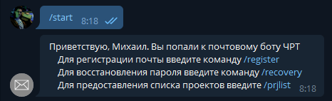
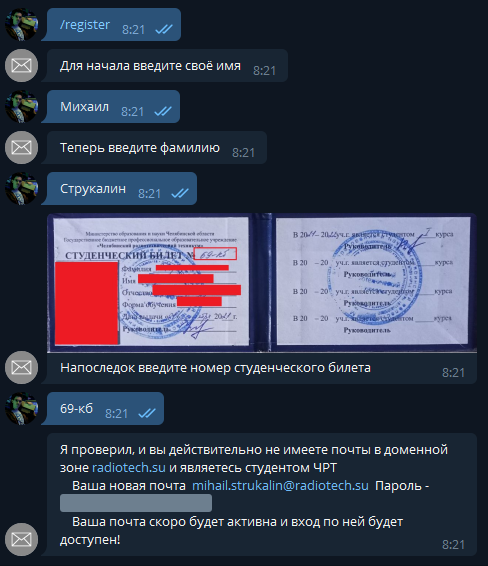
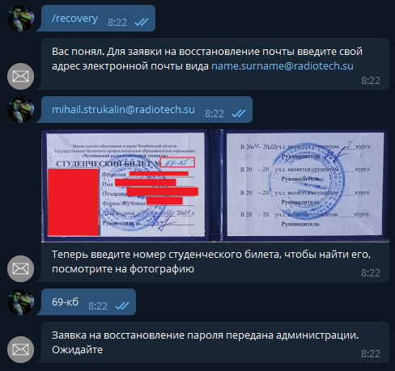
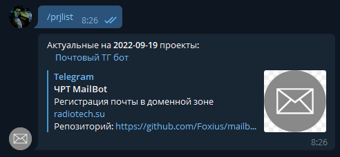
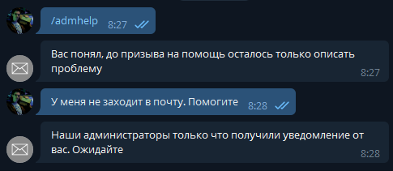

# mailbot_crc

Бот для регистрации и восстановления почты в ЧРТ (name.surname@radiotech.su)

  

*Описание*: Данный бот позволяет зарегестрировать почту студента Челябинского Радиотехнического Техникума

## Демонстрация работы

### Команда /start

### Команда /register

### Команда /recovery

### Команда /prjlist

### Команда /admhelp

# TO-DO

- [ ] Подключить домен к почтовому сервису

- [ ] Продемонстрировать работу бота

- [ ] Сделать видеогайды по использованию бота

- [ ] Подключить Базу Данных студентов
